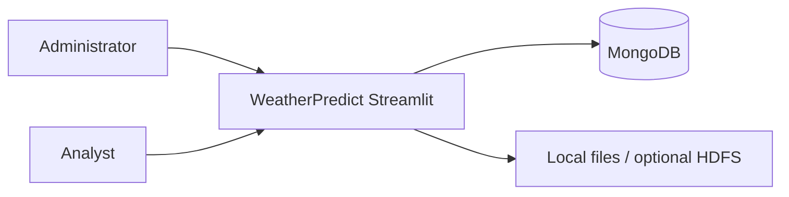
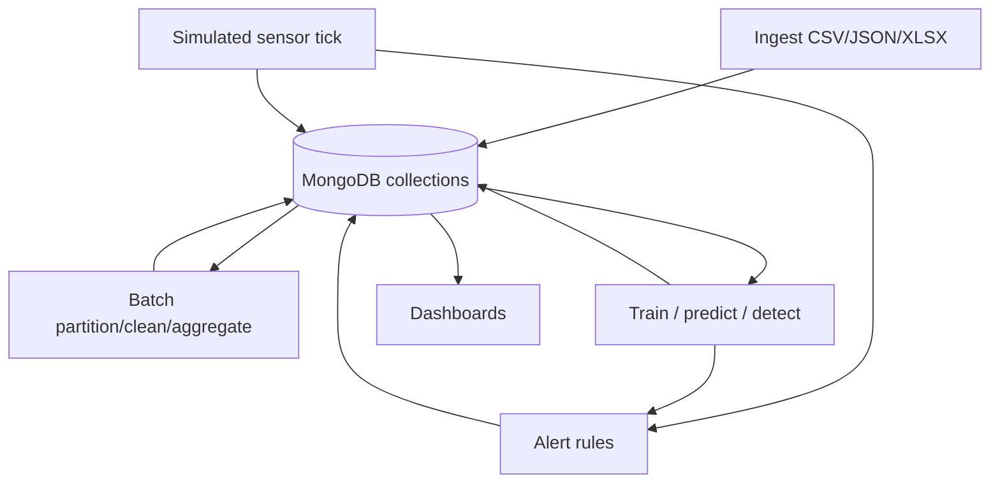
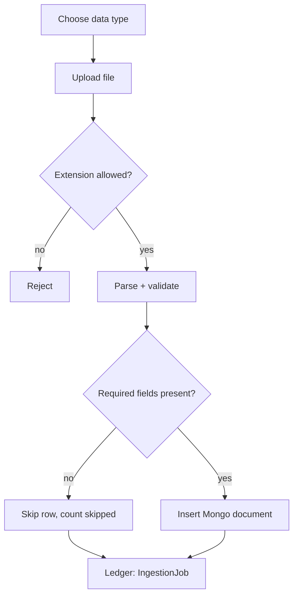
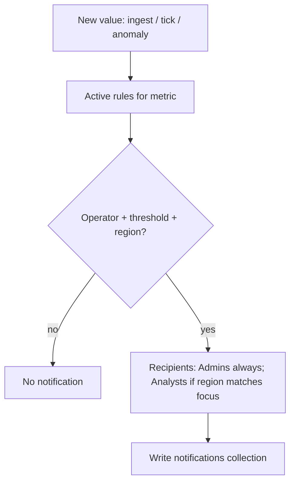

# Diagrams

## Context (level-0)

```mermaid
flowchart LR
  Admin[Administrator]
  Analyst[Analyst]
  App[WeatherPredict Streamlit]
  Mongo[(MongoDB)]
  Files[Local files / optional HDFS]
  Admin --> App
  Analyst --> App
  App --> Mongo
  App --> Files
```

## Level-1 data flow

```mermaid
flowchart TB
  Upload[Ingest CSV/JSON/XLSX]
  Tick[Simulated sensor tick]
  Mongo[(MongoDB collections)]
  Batch[Batch partition/clean/aggregate]
  ML[Train / predict / detect]
  UI[Dashboards]
  Alert[Alert rules]
  Upload --> Mongo
  Tick --> Mongo
  Mongo --> Batch --> Mongo
  Mongo --> ML --> Mongo
  Mongo --> UI
  Tick --> Alert
  ML --> Alert
  Alert --> Mongo
```

## Ingestion activity

```mermaid
flowchart TD
  A[Choose data type] --> B[Upload file]
  B --> C{Extension allowed?}
  C -->|no| D[Reject]
  C -->|yes| E[Parse + validate]
  E --> F{Required fields present?}
  F -->|no| G[Skip row, count skipped]
  F -->|yes| H[Insert Mongo document]
  G --> I[Ledger: IngestionJob]
  H --> I
```

## Alerting activity

```mermaid
flowchart TD
  V[New value: ingest / tick / anomaly] --> R[Active rules for metric]
  R --> M{Operator + threshold + region?}
  M -->|no| X[No notification]
  M -->|yes| S[Recipients: Admins always; Analysts if region matches focus]
  S --> N[Write notifications collection]
```
